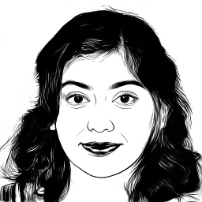
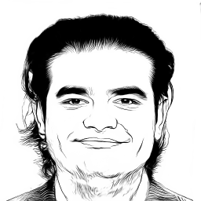

# Image Segmentation for Portrait generation


- UNET:


- U2NET:








 To train u2net:
  ```python u2net_train.py``` 

To train unet:
  ```python train.py``` 

[Original U2NET](https://github.com/xuebinqin/U-2-Net)

[Dataset](https://cg.cs.tsinghua.edu.cn/people/~Yongjin/APDrawingDB.zip)